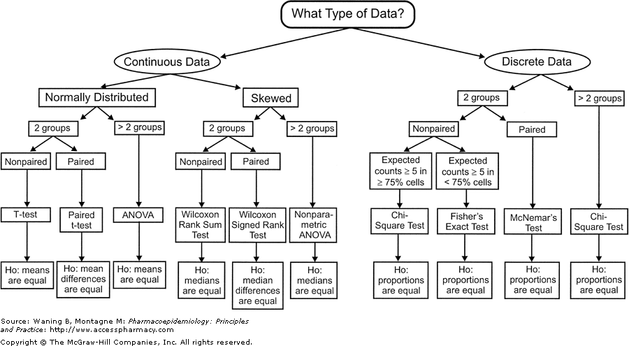

\vspace{-0.2in}

\begin{small}
	
\textbf{Topics}
  
  - Brief Review and Resources
  
  - Bootstrapping
  
  - Randomization/permutation tests
  
  - Exploring statistical power via simulation
	
\end{small}

### Outline of the Course so Far

	
\begin{small}

In the first ~3 weeks of class we have covered:

- Lecture 1: Data and EDA

- Lab 1: Exploratory Data Analysis (EDA)

- Lecture 2: $t$-tests

- Lecture 3: ANOVA and multiple comparisons

- Lab 2: Inference Review and Basic Simulation

- Lecture 4: Transformations and Rank-Based methods

- Lecture 5: Bootstrap and Permutation methods

When should we perform each?  A tree diagram can help us decide; it is based on a few questions:

Q1. What type of ‘response’ variable are we dealing with?  

- Quantitative vs. Categorical?
  
Q2. What kind of comparison are we trying to make?

- 1 group vs. theoretical value?
 
- Compare 2 groups?

- Compare 3+ groups?

- Relate to a quantitative predictor(s)?
  
Q3. What assumptions can we make on the data?  

- Independence?
  
- Distribution? Normality?
  
- Common variance?
  
Q4. What parameters/estimands do we care about?  What test statistic should we use?  

	
\end{small}



\newpage

### Extra readings and resources:
\small

Stat 110 Review: 

- [Stat 110 Online Videos](https://projects.iq.harvard.edu/stat110/home)

- [William Chen's Stat 110 Cheat Sheet](http://www.wzchen.com/probability-cheatsheet)


Stat 111 Review:

- [Keith Chan's Stat 111 Material](https://sites.google.com/site/kwchankeith/teaching/s111)

Extra Practice:

- [Statistical Sleuth Compendium](http://www.math.smith.edu/~nhorton/sleuth3/)

- [CMU's Advanced Data Analysis](http://www.stat.cmu.edu/~cshalizi/ADAfaEPoV/ADAfaEPoV.pdf)

Other Material:

- [t-tests](https://crumplab.github.io/statistics/t-tests.html)

- [ANOVA chapter](https://mathstat.slu.edu/~speegle/_book/anova.html)

- [Rank-Based Testing in R](https://rcompanion.org/handbook/F_04.html)

- [Bootstrapping chapter](https://us.sagepub.com/sites/default/files/upm-assets/68018_book_item_68018.pdf)

- [Bootstrapping and Permutation Testing chapter](http://bcs.whfreeman.com/webpub/statistics/ips9e/9781319013387/companionchapters/companionchapter16.pdf)


\normalsize


#### Question 1: Warm-up with a single sample of data

Suppose researchers are interested in estimating a 95\% confidence interval for the mean clutch volume ($mm^3$) of a particular frog species found on the Tibetan plateau. They have collected a sample of 10 clutches, with volumes: (977.2, 1174.9, 489.8, 478.6, 346.7, 933.2, 871.0, 501.2, 1445.4, 871.0). 

a) Calculate $\overline{X}$ from the data (please use \textsf{R}).
   
```{r 1a}
#enter the data
frog <- c(977.2, 1174.9, 489.8, 478.6, 346.7, 933.2, 871.0, 501.2, 1445.4, 871.0)

#calculate xbar
frog_xbar <- mean(frog)

#histogram
hist(frog, breaks=20)
```    
\vspace{1cm}

b) Draw a single bootstrapped sample then calculate $\overline{X}^\star$. For pseudo-random sampling, remember to use \texttt{set.seed()}.  How does $\overline{X}^\star$ compare to the original?

```{r 1b}
#set seed
set.seed(139)

#draw a single resample
n_samp <- length(frog)
sample(frog, n_samp, replace=T)
``` 


\vspace{1cm}
    
c) Run a simulation with 10,000 iterations and plot the empirical sampling distribution.

```{r 1c}
#set parameters
nsims <- 10^4
n_samp <- length(frog)

#set seed
set.seed(139)

#run simulation
frog_samp <- rep(NA, nsims)

for (i in 1:nsims){
  
  sample <- sample(frog, n_samp, replace=T)
  frog_samp[i] <- mean(sample)
  
}

#plot sampling distributions
hist(frog_samp)
```
\vspace{1cm}
  
d) Construct a 95\% confidence interval for the mean clutch volume using...
    
  i. The formula $\overline{X} \pm t^\star_{n-1} \times S^\star$, where $S^\star$ is the estimated standard error of the bootstrapped sample means, $S^\star = \sqrt{\frac{n}{n-1}}\widehat{SD}(\overline{X}^\star)$, and $\overline{X}^\star$ refers to all the bootstrapped sample means.
        
        
```{r 1d.1}
# inflate s_star bc we're simulating a discrete distribution
# the reality (continuous distribution) is more variable
s_star <- sqrt(n_samp/(n_samp-1))*sd(frog_samp)
t_star <- qt(0.025, n_samp-1)

c(frog_xbar + t_star*s_star, frog_xbar - t_star*s_star)
```
        
  ii. The quantiles of the empirical sampling distribution.
        
        
```{r 1d.2}
quantile(frog_samp, c(0.025, 0.975))
```
\newpage

#### Question 2: Comparing 2 groups

a) Suppose we want to compare the length of hospital stay for patients with the same diagnosis at two different hospitals. At the first hospital, the length of stay in days is: 21, 10, 32, 60, 8, 44, 29, 5, 13, 16, 26, 33. At the second hospital, the length of stay in days is: 86, 27, 10, 68, 87, 76, 125, 60, 35, 73, 96, 44, 238.\footnote{Problem from Rosner, \textit{Fundamentals of Biostatistics}, 7$^{th}$ ed., p. 346.}

  i. Using bootstrapping, estimate a 95% confidence interval for the difference in length of hospital stay between the two hospitals. 
    
```{r 2a.1}
#enter the data
hospital_1 <- c(21, 10, 32, 60, 8, 44, 29, 5, 13, 16, 26, 33)
hospital_2 <- c(86, 27, 10, 68, 87, 76, 125, 60, 35, 73, 96, 44, 238)

#set parameters
nsims <- 10^4
hospital_1_length <- length(hospital_1)
hospital_2_length <- length(hospital_2)
hospital_test_stat <- rep(NA, nsims)

#set seed
set.seed(139)

#bootstrapping
for (i in 1:nsims){
  
  # resample
  hosp_1_samp <- sample(hospital_1, hospital_1_length, replace = T)
  hosp_2_samp <- sample(hospital_2, hospital_2_length, replace = T)
  
  # test stat
  hospital_test_stat[i] <- mean(hosp_1_samp) - mean(hosp_2_samp)
  
}

#visualize
hist(hospital_test_stat)

#confidence interval (quantile method)
quantile(hospital_test_stat, c(0.025, 0.975))
```
    
  ii. Use the permutation test to test the null hypothesis that the mean length of stay does not differ between the two hospitals. In the simulation, use the difference between mean outcomes in the two groups as the test statistic.
    
```{r}
#set parameters
nsims <- 10^4
all <- c(hospital_1, hospital_2)
hospital_1_length <- length(hospital_1)
hospital_2_length <- length(hospital_2)
perm_test_stat <- rep(NA, nsims)

#set seed
set.seed(139)

#re-permute many times
for (i in 1:nsims){
  
  # resample
  samp <- sample(length(all), hospital_1_length, replace=F)
  hosp_1_samp <- all[samp]
  hosp_2_samp <- all[-samp]
  
  # test stat
  perm_test_stat[i] <- mean(hosp_1_samp) - mean(hosp_2_samp)
}

#visualize
hist(perm_test_stat)
```


iii. Use your results from the previous part to estimate the $p$-value for the permutation test.

```{r}

#calculate observed statistic
obs_diff <- mean(hospital_1) - mean(hospital_2)

#calculate p-value
1- mean(obs_diff <= perm_test_stat)

```

\vspace{0.3in}

#### Question 3: Exploring statistical power via simulation

As discussed in Lecture 3, the **power** of a statistical test is the probability that the test will reject the null hypothesis when the alternative hypothesis is true. Power can be expressed as $P(\text{reject }H_0| H_A \text{ true}) = 1 - \beta$, where $\beta$ is the probability of making a Type II error (failing to reject $H_0$ when $H_A$ is true). 

Suppose a pharmaceutical company has developed a new drug for lowering blood pressure, and is planning a clinical trial to test the drug's effectiveness. 

a) Describe two possible study designs for evaluating the efficacy of the new drug relative to an existing drug. 


\vspace{3cm}

Suppose that the population systolic blood pressure (SBP) for individuals taking the standard drug currently on the market is distributed $N(140, 10^2)$ mm Hg. It is thought that the population SBP for individuals taking the new drug will be distributed $N(137, 7^2)$ mm Hg. 

b) Via simulation, estimate the power for an independent two-group test to detect the difference of 3 mm Hg, where the size of each group is $n = 25$. Let $\alpha = 0.05$.
    
```{r}
#set parameters
nsims <- 10^4
n <- 25
level <- 0.05

#set seed
set.seed(139)

#create empty vector to store results
p_value <- rep(NA, nsims)

#simulate results
for (i in 1:nsims){
  
  samp1 <- rnorm(n, 140, 10)
  samp2 <- rnorm(n, 137, 7)
  
  p_value[i] <- t.test(samp1, samp2)$p.value
  
}

#estimate power
1 - mean(p_value > level)

#visualize
hist(p_value)

```
