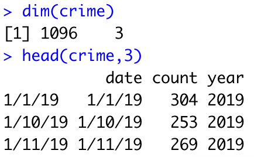

\newcommand{\noin}{\noindent}    
\newcommand{\Var}{\text{Var}}    
\newcommand{\Cov}{\text{Cov}}    

\begin{small} 
		
\noindent This assignment is \textbf{due Friday, October 06 at 11:59pm}, to be handed in on Gradescope (there are separate submissions for the pdf and rmd files). \textbf{Incorporate the \underline{relevant} R output in this R markdown file}; Only the key R output should be displayed for each problem and the relevant parts should be \textbf{highlighted} in some way.  Make sure that you write-up any interpretation of R-code in your own words (don't just provide the output).


\normalsize

\vspace{0.1in}

\noindent \textbf{Collaboration policy (for this and all future homeworks)}: You are encouraged to discuss the problems with other students, but you must write up your solutions yourself and in your own words. Copying someone else's solution, or just making trivial changes is not acceptable. 
\vspace{0.1in}
		
\end{small}

```{r library, echo=F}
library(ggplot2)
```

	
**Problem 1.** 
Recall the formulas for the ordinary least squares (OLS) estimators of $\beta_0,\ \beta_1$:
		$$ \hat{\beta}_1 =\frac{\sum_{i=1}^{n}{(X_i-\bar{X})(Y_i-\bar{Y})}}{\sum_{i=1}^{n}{(X_i-\bar{X})^2}},\hspace{0.2in} \hat{\beta}_0 =\bar{Y}-\hat{\beta}_1\bar{X} $$

(a) Derive the covariance and correlation between $\hat{\beta}_1$ and $\hat{\beta}_0$.  Hint: $\bar{Y}$ and $\hat{\beta}_1)$ are independent.

\textcolor{blue}{$$\Cov(\hat{\beta}_1, \hat{\beta}_0) = \Cov(\hat{\beta}_1, \bar{Y} - \hat{\beta}_1 \bar{X}) = \Cov(\hat{\beta}_1, -\hat{\beta}_1\bar{X}) + \Cov(\hat{\beta}_1, \bar{Y})$$
The second term is 0 because $\bar{Y}$ and $\hat{\beta}_1$ are independent, so we have:
$$=-\bar{X} \Cov(\hat{\beta}_1, \hat{\beta}_1) = -\bar{X}\Var(\hat{\beta}_1)$$}

\textcolor{blue}{Using the definition of Covariance and our result from above, we get: 
$$Corr(\hat{\beta}_1, \hat{\beta}_0) = \frac{\Cov(\hat{\beta}_1, \hat{\beta}_0)}{\sqrt{\Var{\hat{\beta}_1}\Var{\hat{\beta}_0}}} = -\frac{\bar{X}\Var{\hat{\beta}_1}}{\sqrt{\Var{\hat{\beta}_1}\Var{\hat{\beta}_0}}} = -\bar{X}\sqrt{\frac{\Var{\hat{\beta}_1}}{\Var{\hat{\beta}_0}}}$$}

(b) In terms of $\bar{X}$, when will this correlation be positive?  When will it be negative?  In 1-2 sentences, justify why this makes sense if $\bar{X}>0$ (think where the scatterplot and regression line lies on the coordinate system). 

\textcolor{blue}{Using our derivations in part (a), we know that the correlation is positive when $\bar{X}$ is negative; the correlation is negative when $\bar{X}$ is positive. This makes sense because fixing $\bar{X}$ to be positive (for example), as the intercept increases, the slope should decrease to keep the overall mean the same, so the correlation between the intercept and the slope is negative. The reverse is true for when $\bar{X}$ is negative.}

(c) Show that the variance of $\hat{\mu}_{Y|X_0}$ is $\sigma^2\left[\frac{1}{n}+\frac{(X_0-\bar{X})^2}{(n-1)S_X^2}\right]$  (which is used in creating the confidence intervals and prediction intervals around the regression line at a particular $X_0$).

\textcolor{blue}{By substitution: 
$$\Var(\hat{\mu}_{Y|X_0}) = \Var(\hat{\beta}_0 + \hat{\beta}_1X|X=X_0) = \Var(\hat{\beta}_0 + \hat{\beta}_1X_0)$$
Through decomposition: 
$$=\Var(\hat{\beta}_0) + \Var(\hat{\beta}_1X_0) + 2\Cov(\hat{\beta}_0, \hat{\beta}_1X_0)$$
Taking $X_0$ outside of the $\Cov$ expression and using the result from part (a):
$$=\Var(\hat{\beta}_0) + \Var(\hat{\beta}_1X_0) + 2X_0 \cdot (- \bar{X}\Var(\hat{\beta}_1))$$
Reorganizing:
$$=\Var(\hat{\beta}_0) + X_0\Var(\hat{\beta}_1)[X_0 - 2\bar{X}]$$
Using the sampling distributions of $\hat{\beta}_0$ and $\hat{\beta}_1$:
$$=\sigma^2[\frac{1}{n} + \frac{\bar{X}^2}{(n-1)S_X^2}] - X_0\sigma^2\frac{1}{(n-1)S_X^2}[X_0-2\bar{X}]$$
$$=\sigma^2[\frac{1}{n} + \frac{\bar{X}}{(n-1)S_X^2} - \frac{X_0[X_0-2\bar{X}]}{(n-1)S_X^2}]$$
$$=\sigma^2[\frac{1}{n}+\frac{(\bar{X}-X_0)^2}{(n-1)S_X^2}]$$}


\newpage

**Problem 2.** 
In class we saw that the ordinary least-squares (OLS) slope estimate, $\hat{\beta}_1$, has the following sampling distribution:
	$$ \hat{\beta}_1 \sim N\left(\beta_1,\frac{\sigma^2}{SSX}\right)$$
where $\beta_1$ is the true slope of the regression line, $\sigma^2$ is the true variance of the residuals, and $SSX$ is the sums of square for the predictor, $X$: $SSX = \sum_{i=1}^{n}{(X_i-\bar{X})^2} = (n-1)S_X^2$.  
		
This problem steps you through the steps of deriving this result.  Hint: it will be useful to use the fact that $\sum_{i=1}^{n}{(X_i-\bar{X})(Y_i-\bar{Y})} = \sum_{i=1}^{n}{(X_i-\bar{X})Y_i}$.

(a) Determine $E(\hat{\beta}_1)$.

\textcolor{blue}{Using the definition of $\hat{\beta}_1$:
$$E(\hat{\beta}_1) = E[\frac{\sum_{i=1}^n(X_i-\bar{X})(Y_i-\bar{Y})}{\sum_{i=1}^n(X_i-\bar{X})^2}]$$
Using the hint for the numerator:
$$=E[\frac{\sum_{i=1}^n(X_i-\bar{X})Y_i}{\sum_{i=1}^n(X_i-\bar{X})^2}]$$
Since $\beta_1$ is a constant:
$$=E[\beta_1] = \beta_1$$}
	
(b) Determine $\text{Var}(\hat{\beta}_1)$ 

\textcolor{blue}{Using the 2nd step of part (a) and substituting that for $\hat{\beta}_1$:
$$\text{Var}(\hat{\beta}_1) = \Var(\frac{\sum_{i=1}^n(X_i-\bar{X})Y_i}{\sum_{i=1}^n(X_i-\bar{X})^2})$$
Setting the denominator equal to $SSX$:
$$=\Var(\frac{\sum_{i=1}^n(X_i-\bar{X})Y_i}{SSX})$$
Taking $SSX$ and $\sum_{i=1}^n(X_i-\bar{X})$ out of the $\Var$ expression because they are constant:
$$=\frac{1}{SSX^2}\sum_{i=1}^n(X_i-\bar{X})^2 \cdot \Var(Y_i)$$
Since $SSX$ and $\sum_{i=1}^n(X_i-\bar{X})$ cancel each other out:
$$=\frac{\Var(Y_i)}{SSX} = \frac{\sigma^2}{SSX}$$}

(c) Show that $\hat{\beta}_1$ is normally distributed (based on the `story' of a normal r.v.).

\textcolor{blue}{From the previous parts, we know that $\hat{\beta}_1 = \frac{\sum_{i=1}^n(X_i-\bar{X})Y_i}{\sum_{i=1}^n(X_i-\bar{X})^2}$. Since $Y$ is normally distributed and $X_i$ take constant values, $\hat{\beta}_1$ is a scaled normal. So $\hat{\beta}_1$ is normally distributed according to the property of the normal distribution.}

\newpage


**Problem 3.**
The file `homesim.csv' contains 7 variables ($Y, X1, X2, ..., X6$) created by an online computer program.  

(a) Run a multiple regression model of $Y$ against all six $X$ variables. Include the R regression coefficients table.  Which predictor variables are significantly associated with the response variable?

\textcolor{blue}{The null hypotheses are that the coefficients associated with the predictor variables are 0. In the R regression coefficient table below, we can find the $t$ statistic and p value for the corresponding predictor variable (looking that the `t value` and the `Pr(>(t))` columns).}

\textcolor{blue}{We find that for all predictor variables, the p-value for the null hypothesis is very small, much smaller than 0.05, so we can reject that null hypothesis and conclude that the coefficients associated with predictors are significant. So the test shows that all predictor variables are significantly associated with the response variable, but we still need to examine the validity of the assumptions of the test.}

```{r 3a}
homesim <- read.csv("data/homesim.csv")

lm3a <- lm(Y~X1+X2+X3+X4+X5+X6, data=homesim)
summary(lm3a)
```


(b) Create the residuals and predicted values from the full 6-predictors regression model in the previous part.  Create the QQplot of the residuals and the residuals-vs.-predicted values scatterplot.  Use these plots to comment on the assumptions for this model. 

\textcolor{blue}{(1) In the first plot, the residuals do not fall symmetrically above and below the horizontal line; this indicates that the linearity assumption is violated. (2) And because the residuals are not equidistant from the horizontal line as we move left to right (we even have a Homer Simpson pattern in the middle), the constant variance assumption is also violated. (3) We see that the mean and variance of the residuals exist, so the existence assumption is met. (4) In the QQ plot, the sample quantiles are shown to significantly deviate from the normal theoretical quantiles, specifically at the two tail ends, indicating that the normality assumption is also violated. (5) It is unclear whether the independence assumption is met based on just these plots.}

```{r 3b}
# resid vs fitted values
plot(lm3a$fitted.values, lm3a$residuals, cex=0.2)
abline(h=0)

## qqplot
qqnorm(lm3a$residuals)
qqline(lm3a$residuals)
```


\newpage

  

**Problem 4.** 
This problem revolves around two different data sets: `boston_crime.csv' (a list of all the incidents of crime in Boston from January 1, 2018 until December 31, 2020 from [here](https://data.boston.gov/dataset/crime-incident-reports-august-2015-to-date-source-new-system)) and 'boston_weather.csv' (containing daily weather-related measurements from [here](https://www.wunderground.com/history/monthly/us/ma/boston/KBOS/date/2020-12)) to look at the association between crime and weather.  

Use these two data sets to answer the following questions:

(a) Create three new data frames `crime_raw19`, `crime_raw20`, and `crime_raw21` that only contain the reported crimes from 2019, 2020, and 2021, respectively.  How many observations and how many variables are there in each? 

\textcolor{blue}{The 2019df has 98,096 observations; the 2020 df has 70894 observations; the 2021 df has 71721 observations. All three dfs have 19 variables.}

```{r 4a}
# load data
crime_raw = read.csv("data/boston_crime.csv")
weather = read.csv("data/boston_weather.csv")

# rename
colnames(crime_raw) <- tolower(colnames(crime_raw))

# subset
crime_raw <- crime_raw[crime_raw$year %in% c("2019", "2020", "2021"),]

# subset
crime_raw19 <- crime_raw[crime_raw$year == "2019",]
crime_raw20 <- crime_raw[crime_raw$year == "2020",]
crime_raw21 <- crime_raw[crime_raw$year == "2021",]

lapply(list(crime_raw19, crime_raw20, crime_raw21), dim)
```


(b) Determine the number of incidents on each day in 2019, 2020, and 2021 (there are many approaches to do this, but it takes one line of code using `tapply` for each).  Compare the distributions of the daily number of incidents for 2019, 2020, and 2021.

\textcolor{blue}{I created 3 histogram plots of daily count of crime, one for each year (the x-axis shows the daily number of crimes, the y-axis shows the number of days with such a crime count, and the plots are for the years 2019, 2020, and 2021 sequentially). We see that across all three years, the distribution is roughly symmetric and bell-shaped. There seems to have been more crime reported daily in 2019 than in 2020 and in 2021 because for 2019, the daily counts are mostly between 200 and 350, whereas they are mostly between 150 and 250 for 2021.}

```{r 4b, results='hide',fig.keep='all'}
par(mfrow=c(1,3))
lapply(list(crime_raw19, crime_raw20, crime_raw21), function(df){
  daily <- tapply(df$date, df$date, length)
  hist(daily, breaks=24, main="Distribution of daily crime count")
})
```


(c) Create a new data frame called `crime` that has three variables (for 2019, 2020, 2021 combined): `date`, `year`, and `count` which counts the number of incidents of each day.  It should look something similar to this:

{width=1.5in}
```{r 4c}
crime <- as.data.frame(table(crime_raw$date))
colnames(crime) <- c("date","count")
crime$year <- as.factor(format(as.Date(crime$date, format="%m/%d/%y"), format = "%y"))
```

(d) Formally test whether the average daily number of incidents is equal in these three years.

\textcolor{blue}{The null hypothesis is that the average daily number of crimes is equal across these three years, and the alternative hypothesis is that at least one year has a different average than other years. Since we are comparing multiple means, we conduct an \texttt{ANOVA} test. The F statistic is 651 with df=2. The p-value is smaller than 0.05, so we reject the null hypothesis and conclude at at least one year has a different average daily number of crimes.}

```{r 4d}
aov4 <- aov(count~year, data=crime)
summary(aov4)
```


(e) Merge the `crime` data frame with the `weather` data frame created below based on `date`. Print out the dimensions of this merged data frame (called it `crime_and_weather`).

*Hint: the `merge` function in \textsf{R} will be useful.

Note: we provide the combined data frame for you in a csv-file ('combined.csv') in case you were unable to complete the data wrangling tasks above.

```{r 4e}
# merge
crime_and_weather <- merge(crime, weather, by=intersect("date", "date"))
dim(crime_and_weather)
```


(f) Fit a linear model to predict the number of crime incidents on a day in Boston from the high temperature (`maxtemp`) in the city that day, and formally test whether this association is significant.  Provide a visual to support your conclusion.

\textcolor{blue}{The null hypothesis is that the association between the daily count of crimes and the daily high temperature is not significant. The alternative hypothesis is that this association is significantly different than 0. The regression table below shows that the $t$ statistic is 10.28, df=1094. Since the p-value is less than $2e^{-16}$ and much smaller than 0.05, we reject the null hypothesis and conclude that the association is significant.}

\textcolor{blue}{For the supporting visual, I included a scatterplot, plotting the daily crime count and the daily high temperature. We can see that the line of best fit has a non-zero slope, indicating significant association.}

```{r 4f}
# lm
lm4f <- lm(count~maxtemp, data=crime_and_weather)
summary(lm4f)

# visual
plot(count~maxtemp, data=crime_and_weather)
abline(lm4f)
```


(g) Create a visual to compare the daily number of incidents over the course of the year ($Y$ = `count`, $X$ = day number in the year (Jan 1 is day 1)) which ranges from 1 to 366, and use different colors and/or markers to differentiate observations from the three years.  Interpret what you notice in this visual with respect to how crime is associated with the seasons and the three years.  

*Hint: the \textsf{R} functions `as.Date` may be useful here (you can subtract two `Date`s in \textsf{R} to determine the difference in the number of days).

*Note, we will look further into this in the next problem set.

\textcolor{blue}{I created the scatterplot below (2019 is in black, 2020 is in red, and 2021 is in green). We can see that 2019 has the highest daily count of crime on average, followed by comparable 2020 and 2021. Seasonally, the daily count tends to be low in the spring and then becomes higher during the summer months, before dipping again towards the end of the year. During spring of 2020, there was a significant drop in daily counts of crime, which makes sense because it was the beginning of isolation where most people stayed indoors.}

```{r 4g}
crime$day <- as.numeric(format(as.Date(crime$date, format("%m/%d/%y")), format("%j")))
plot(count~day, col = year, data=crime)
```


\newpage


**Problem 5.**
This problem steps you through a simulation to explore the robustness of linear regression in the presence of assumption violations.  Specifically, how is the Type I error rate for the $t$-test for $H_0:\beta_1=0$ affected when the normality and constant variance assumptions are violated.  Assume the following data generating process for independent $i=1,2,...,n$ observations:
$$X_i \sim \text{Unif}(0,1)$$
Let $Y_i = \beta_0+\beta_1X_i+\varepsilon_i$ where $\beta_0=10$, $\beta_1=0$, and the residuals, $\varepsilon_i$, come from one of 3 different distributions:

  (i) $\varepsilon_i \sim N(0,2^2)$
  (ii) $\varepsilon_i\sim a+b\cdot\text{Exp}(\lambda=1)$
  (iii) $\varepsilon_i|X_i\sim w\cdot N(0,X_i^2)$
  
Note: we will also vary $n \in \{10,30\}$.

(a) Determine the values of $a$, $b$, and $w$ above so that the residuals have a mean of zero and have variance of $2^2$ marginally for each of the 3 conditions above.  Show your work.

\textcolor{blue}{(ii) Using the mean and variance of $Exp$ from the table of distributions cheatsheet:
$$E(\varepsilon_i) = E(a+b\cdot\text{Expo}(\lambda=1)) = a + b\cdot E(\text{Expo}(\lambda=1)) = a + b = 0$$}

\textcolor{blue}{$$\Var(\varepsilon_i) = \Var(a+b\cdot\text{Expo}(\lambda=1)) = b^2\cdot \Var(\text{Expo}(\lambda=1)) = b^2 = 2^2$$}

\textcolor{blue}{We solve the two equations to get $(a,b) = (-2, 2)$}

\textcolor{blue}{(iii) Using Adam's Law:
$$E(\varepsilon_i) = E(E(\varepsilon_i|X_i)) = E(0) = 0$$ so the mean condition is always satisfied.}

\textcolor{blue}{Using Eve's Law:
$$\Var(\varepsilon_i) = E(\Var(\varepsilon_i|X_i)) + \Var(E(\varepsilon_i|X_i)) $$
$$= E(w^2 \cdot \Var(N(0,X_i^2)))  + \Var(0) = E(w^2 \cdot X_i^2) + 0 = w^2 E(X_i^2)$$
Since $X_i \sim \text{Unif}(0,1)$, we have $\Var(X_i) = \frac{1}{12}$ and $E(X_i) = \frac{1}{4}:$
$$=w^2 \cdot (\Var(X_i) + E(X_i)^2) = w^2 (\frac{1}{12} + \frac{1}{4}) = \frac{w^2}{3} = 2^2$$
We get $w = 2\sqrt{3}$}

(b) Create three samples of $n=30$ observations: one for each of the 3 scenarios for the residuals above (the code in part (c) below may help you organize your thoughts).  Plot the 3 scatter plots of $Y$ vs. $X$ for each of the 3 scenarios.  Comment on what you see (in relationship to regression assumptions).

\textcolor{blue}{In sample 1, the regression assumptions for $\epsilon$ are satistifed: $Y_i$ are normally distributed with constant variance. In the plot, this makes sense because Y is centered around the true value 10 and the variation surrounding 10 is homogenous.}

\textcolor{blue}{In sample 2, $\epsilon$ is distributed $Expo$ instead of $Normal$; this makes sense because all the Y values are not homogenously distant from 10 (we can see that the larger Y values are further away from 10 than the smaller Y values). The linearity and normality assumptions are not met, but the homoskedasticity assumption is met because we don't see different variance from 10 as we move along the x axis.}

\textcolor{blue}{In sample 3, $\epsilon$ is distributed $Normal$ but with unequal variance (as X increases, conditional variance increases). We see a funel pattern in the plot because as X increases, Y has higher and higher variation while still being symmetric around 10 (so normality assumption is met). The homoskedasticity assumption is not met.}

```{r 5b}
set.seed(139)
n <- 30
b0 <- 10
b1 <- 0
x <- runif(n)

epsilon1 <- rnorm(n,0,2)
epsilon2 <- 2 - 2*rexp(n, 1)
epsilon3 <- 2*sqrt(3)*rnorm(n,0,x)

lapply(list(epsilon1, epsilon2, epsilon3), function(epsilon){
  y <- b0 + b1*x + epsilon
  plot(x, y)
  abline(a=10, b=0)
})
```


(c) Define a function called \texttt{reg.sim} that could be used to perform the simulation for the specific scenarios above. It should have at least the following arguments:
  
  - \texttt{n}: the sample size with default of 10.

  - \texttt{e.dist}: a string/character variable with 3 options: 'norm', 'expo', or 'weighted' one for each of the scenarios above with a default of 'norm'.
  
  - \texttt{nsims}: the number of simulation repetitions with default 2000.
  
  - \texttt{seed}: the value for \texttt{set.seed}, if applicable, with default 'NA'.

and returns a list that includes:
  
  - \texttt{betas}: a variable for all the estimated slopes from OLS

  - \texttt{t.pvalues}: a variable for all the estimated p-values from OLS

The code below frames the function for you (in the \textsf{R}-markdown file).  Your job is to fill out the meat of the function, and then use it in the next part.

```{r 5c}
b0 <- 10
b1 <- 0

reg.sim = function(n=10,e.dist="norm",nsims=2000,seed=NA){
  if(!is.na(seed)){set.seed(seed)}
  # your code here
  
  # 0. before the for loop define storage vectors for saving betas and t.pvalues
  betas   <- c(NA, nsims)
  t.pvalues <- c(NA, nsims)
  
  for(i in 1:nsims){
    # Create 'nsims' sets of data:
    # 1. generate the data, first x~Unif(0,1) then y based on the scenario
    x <- runif(n)
    
    if(e.dist=="norm"){
      epsilon <- rnorm(n,0,2)
    }
    if(e.dist=="expo"){
      epsilon <- 2 + -2*rexp(n, 1)
    }
    if(e.dist=="weighted"){
      epsilon <- 2*sqrt(3)*rnorm(n,0,x)
    }
    
    y <- b0 + b1*x + epsilon
    mod <- lm(y~x)
    betas[i] <- summary(mod)$coefficients[2,1]
    t.pvalues[i] <- summary(mod)$coefficients[2,4]

    #if(i%%100==0){print(paste("done with iteration, i =",i))}
  }
  # 3. return the two variables as a list: p-values and betas 
  return(list(betas=betas,t.pvalues=t.pvalues))
}
```

(d) Use your function above to perform the simulation with 2000 repetitions under 6 scenarios: the crosses of the 3 residuals scenarios with the two possible sample sizes.  Determine the rejection rate for each of the 6 scenarios, and present in an organized tabular form.

```{r 5d}
n1 <- 10
n2 <- 30
b0 <- 10
b1 <- 0

pval1 <- reg.sim(n=n1, e.dist = "norm", seed = 139)[[2]]
pval2 <- reg.sim(n=n1, e.dist = "expo", seed = 139)[[2]]
pval3 <- reg.sim(n=n1, e.dist = "weighted", seed = 139)[[2]]
pval4 <- reg.sim(n=n2, e.dist = "norm", seed = 139)[[2]]
pval5 <- reg.sim(n=n2, e.dist = "expo", seed = 139)[[2]]
pval6 <- reg.sim(n=n2, e.dist = "weighted", seed = 139)[[2]]

results = list(pval1, pval2, pval3, pval4, pval5, pval6)

reject <- unlist(lapply(results, function(pval){
  mean(pval < 0.05)
}))

# display table
tbl_5d <- data.frame("n=10"= c(reject[1], reject[2], reject[3]),
                     "n=30"= c(reject[4], reject[5], reject[6]))
row.names(tbl_5d) <- c("norm", "expo", "weighted")
tbl_5d
```


(e) How does the $t$-test for the slope in simple regression behave in the presence of assumption violations?  To which assumption(s) is the $t$-test more robust?  How does sample size play a role?  Please limit your response to 5 or fewer sentences.

\textcolor{blue}{The $t$-test for slope does not have our ideal rejection rate ($\alpha$ = 0.05) when assumptions are violated (we see that when the normality and homogeneity of variance assumptions are met, the rejection rates across the 1st row are approximately 0.05). The $t$-test is more robust to the non-normality assumption: in the expo case, the rejection rate is still approximately 0.05, whereas when the homogeneity in variance assumption is violated, the rejection rate increases to more than 0.08. As the sample size increases, the rejection rate gets closer to our ideal rejection rate of 0.05.}
