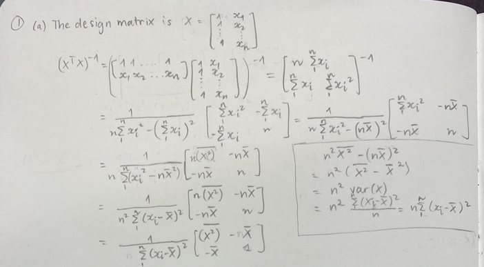
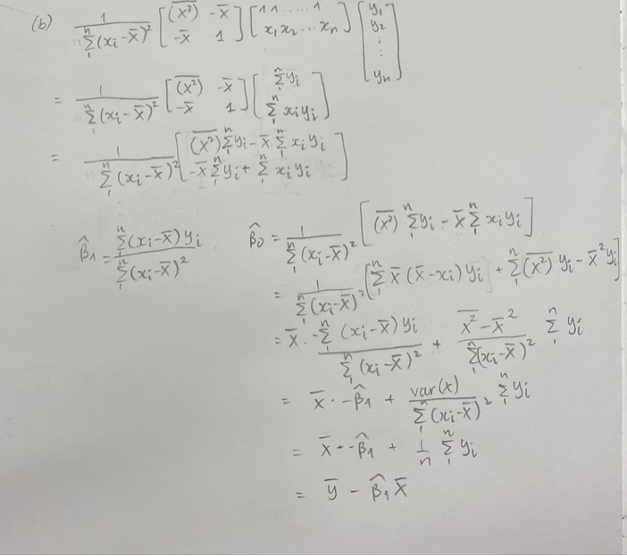
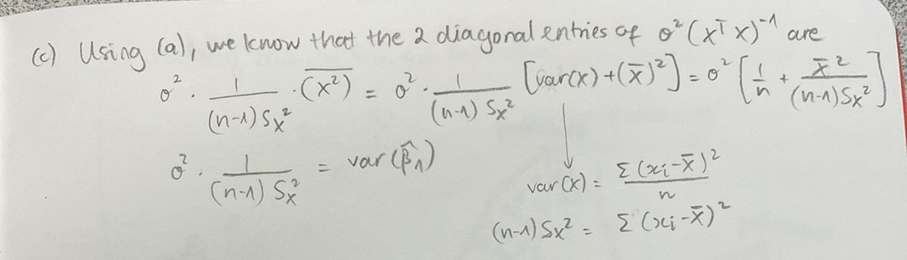

\newcommand{\noin}{\noindent}    
\newcommand{\Var}{\text{Var}}    
\newcommand{\Cov}{\text{Cov}}    

\begin{small} 
		
\noindent This assignment is \textbf{due Friday, October 13 at 11:59pm}, handed in on Gradescope (remember, there are two separate submissions, one for your pdf, and another for you rmd file).  Show your work and provide clear, explanations when asked.  \textbf{Incorporate the \underline{relevant} R output in this R markdown file}. Only the key output should be displayed for each problem and the relevant parts should be \textbf{highlighted} in some way.  Make sure that you write-up any interpretation of R-code in your own words (don't just provide the output).


\normalsize

\vspace{0.1in}

\noindent \textbf{Collaboration policy (for this and all future homeworks)}: You are encouraged to discuss the problems with other students, but you must write up your solutions yourself and in your own words. Copying someone else's solution, or just making trivial changes is not acceptable. 
\vspace{0.1in}
		
\end{small}
	

**Problem 1.** 

Consider a simple linear regression, with an intercept and one predictor.
	
(a) Write down the design matrix $\mathbf{X}$ and calculate the 2 x 2 matrix $(\mathbf{X}^T \mathbf{X})^{-1}$.



(b) Show that the vector $\hat{\vec{\beta}}=(\mathbf{X}^T \mathbf{X})^{-1} \mathbf{X}^T \vec{Y}$ provides the usual least squares estimates of the intercept and the slope.



(c) Show that, for a simple linear regression, the diagonal elements of the 2 x 2 matrix $\sigma^2 (\mathbf{X}^T \mathbf{X})^{-1}$ provide the usual variances of the least squares estimates of the intercept and the slope for a simple linear regression.

\textcolor{blue}{We see that the first diagonal entry is equivalent to $\Var(\hat{\beta_0})$.}
		

		
(d) A second predictor is being considered for inclusion in the model ($X_2$).  Under what conditions will its presence in the model have no effect on the estimates of $\beta_0$ and $\beta_1$?

\textcolor{blue}{This happens when $X_2$ is perfectly uncorrelated with $X_1$ and has mean 0. None of the variation in $Y$ already explained by $X_1$ can be explained by $X_2$, keeping $\beta_1$ unchanged, and when $X_2$ has mean 0, adding $X_2$ has no effect on the intercept coefficient.}

\textcolor{blue}{Consider the opposite situation, when the estimates of $\beta_0$ and $\beta_1$ do change: If we only include $X_1$ in the model, some of the variation in $Y$ is inappropriately explained by $X_1$. When we add $X_2$ to the model ($X_2$ is correlated with $X_1$), some of the variation in $Y$, previously inappropriately explained by $X_1$, is now appropriately explained by $X_2$, thereby changing the estimates of $\beta_1$. And if $X_2$ has mean non-zero, the estimate for $\beta_0$ needs to be adjusted accordingly when we add $X_2$ to the model.}

\newpage


**Problem 2.**

The data set *pres_elections.csv* contains the following variables state by state including DC ($n=51$)...we will not use all of them:

\begin{tabular}{rl}
\textbf{gap20repub}: & the gap in presidential voting from 2020 (Trump - Biden)  \\ 
\textbf{gap16repub}: & the gap in presidential voting from 2016 (Trump - Clinton)  \\
\textbf{unemployed}: & percent of residents that were unemployed on Nov. 1, 2020 \\
\textbf{beer}: &  the average gallons of beer drunk by a state's inhabitants based on a nationwide survey \\
\textbf{gmormon}: & percent of residents that are Mormon\\
\textbf{hispanic}: & the percent of a state's inhabitants that consider themselves Hispanic \\
\textbf{female}: & percent of residents that are women\\
\textbf{collegedegree}: & percent of adult residents with at least a bachelor's degree\\
\textbf{governor}: & an indicator for whether the governor of the state was Republican during the election of 2020\\
\end{tabular}


\vspace{0.1in}

(a) Plot 3 separate scatterplots: $Y=$ `gap20repub` and variables `gap16repub`, `unemployed`, and `beer` as the $X$ variable for each.  What do you notice?

\textcolor{blue}{In the 1st plot, \texttt{gap20repub} and \texttt{gap16repub} appear to have a strong positive linear relationship; this makes sense because if a state leaned strongly Republican for 2016, it is likely that they would vote the same in 2020 and vice versa. In the 2nd plot,\texttt{gap20repub} and \texttt{unemployed} seem to have a very weak, slightly negative correlation. There doesn't seem to be any clear relationship between \texttt{gap20repub} and \texttt{beer}, per the 3rd plot. There seems to be one outlier -- one state that is distinctively more Democratic-leaning than others (apparently it is DC, but this might just be weird data coding).}

```{r 2a}
pres_elections <- read.csv("data/pres_elections.csv")

plot(gap20repub ~ gap16repub, pres_elections)
plot(gap20repub ~ unemployed, pres_elections)
plot(gap20repub ~ beer, pres_elections)

pres_elections[pres_elections$gap20repub < -60, "state"]
```


(b) Fit 3 separate regression models to predict `gap20repub`: **Model A** using $X =$ `gap16repub`, **Model B** using $X =$ `unemployed`, and **Model C** using $X =$ `beer`.  Include the R summary output and interpret the slope coefficients and their significances.

```{r 2b}
modA <- lm(gap20repub ~ gap16repub, pres_elections)
summary(modA)

modB <- lm(gap20repub ~ unemployed, pres_elections)
summary(modB)

modC <- lm(gap20repub ~ beer, pres_elections)
summary(modC)
```

\textcolor{blue}{For model A, the null hypothesis is that the association between \texttt{gap20repub} and \texttt{gap16repub} is not significant (i.e. the slope coefficient is 0); the alternative hypothesis is that the association is significant. The regression table shows that the $t$ statistic=`r summary(modA)$coefficients[2,3]` with df=49. The p-value is `r summary(modA)$coefficients[2,4]` < 0.05, so we reject the null hypothesis and conclude that the association between \texttt{gap20repub} and \texttt{gap16repub} is significant. The slope coefficient of `r summary(modA)$coefficients[2,1]` means that a 1-unit increase in \texttt{gap16repub} is associated with a `r summary(modA)$coefficients[2,1]` unit increase in \texttt{gap20repub}.}

\textcolor{blue}{For model B, the null hypothesis is that the association between \texttt{gap20repub} and \texttt{unemployed} is not significant (i.e. the slope coefficient is 0); the alternative hypothesis is that the association is significant. The regression table shows that the $t$ statistic=`r summary(modB)$coefficients[2,3]` with df=49. The p-value is `r summary(modB)$coefficients[2,4]` < 0.05, so we reject the null hypothesis and conclude that the association between \texttt{gap20repub} and \texttt{unemployed} is significant. The slope coefficient of `r summary(modB)$coefficients[2,1]` means that a 1-unit increase in \texttt{unemployed} is associated with a `r summary(modB)$coefficients[2,1]` unit increase in \texttt{gap20repub}.}

\textcolor{blue}{For model C, the null hypothesis is that the association between \texttt{gap20repub} and \texttt{beer} is not significant (i.e. the slope coefficient is 0); the alternative hypothesis is that the association is significant. The regression table shows that the $t$ statistic=`r summary(modC)$coefficients[2,3]` with df=49. The p-value is `r summary(modC)$coefficients[2,4]` < 0.05, so we reject the null hypothesis and conclude that the association between \texttt{gap20repub} and \texttt{beer} is significant. The slope coefficient of `r summary(modC)$coefficients[2,1]` means that a 1-unit increase in \texttt{beer} is associated with a `r summary(modC)$coefficients[2,1]` unit increase in \texttt{gap20repub}.}

(c) Plot the residuals from **Model A** as $Y$ against `unemployed` as $X$.  Fit the regression model for these variables and include the R summary output (call this **Model D**).  

```{r 2c}
plot(residuals(modA) ~ pres_elections$unemployed)

modD <- lm(residuals(modA) ~ pres_elections$unemployed)
summary(modD)
```


(d) Fit a multiple regression model, **Model E** to predict `gap20repub` from  `gap16repub` and `unemployed`. Include the R summary output and interpret the slope coefficients and their significances.  

```{r 2d}
modE <- lm(gap20repub ~ gap16repub + unemployed, pres_elections)
summary(modE)
```

\textcolor{blue}{For model E, regarding the predictor \texttt{gap16repub}, the null hypothesis is that for states with the same \texttt{unemployed} value, the association between \texttt{gap20repub} and \texttt{gap16repub} is not significant (i.e. the slope coefficient is 0); the alternative hypothesis is that the association is significant. The regression table shows that the $t$ statistic=`r summary(modE)$coefficients[2,3]` with df=48. The p-value is `r summary(modE)$coefficients[2,4]` < 0.05, so we reject the null hypothesis and conclude that holding the \texttt{unemployed} variable constant, the association between \texttt{gap20repub} and \texttt{gap16repub} is significant. The slope coefficient of `r summary(modE)$coefficients[2,1]` means that if we keep \texttt{unemployed} fixed, a 1-unit increase in \texttt{gap16repub} is associated with a `r summary(modE)$coefficients[2,1]` unit increase in \texttt{gap20repub}.}

\textcolor{blue}{For model E, regarding the predictor `unemployed`, the null hypothesis is that for states with the same \texttt{gap16repub} value, the association between \texttt{gap20repub} and \texttt{unemployed} is not significant (i.e. the slope coefficient is 0); the alternative hypothesis is that the association is significant. The regression table shows that the $t$ statistic=`r summary(modE)$coefficients[3,3]` with df=48. The p-value is `r summary(modE)$coefficients[3,4]` is barely smaller than 0.05, so we reject the null hypothesis and conclude that holding the \texttt{gap16repub} variable constant, the association between \texttt{gap20repub} and \texttt{unemployed} is significant. The slope coefficient of `r summary(modE)$coefficients[3,1]` means that if we keep \texttt{gap16repub} fixed, a 1-unit increase in \texttt{unemployed} is associated with a `r summary(modE)$coefficients[3,1]` unit increase in \texttt{gap20repub}.}

(e) Fit a multiple regression model, **Model F**, to predict `gap20repub` from `gap16repub`, `unemployed`, and `beer`.  Include the R summary output.

```{r 2e}
modF <- lm(gap20repub ~ gap16repub + unemployed + beer, pres_elections)
summary(modF)
```


(f) Compare the results from **Model B**, **Model D**, **Model E**, and **Model F** for the coefficient estimates for `unemployed`.  Briefly explain the reasons for the results.

\textcolor{blue}{For the models, the corresponding coefficient estimates for \texttt{unemployed} are `r round(summary(modB)$coefficients[2,1],3)`, `r round(summary(modD)$coefficients[2,1],3)`, `r round(summary(modE)$coefficients[3,1],3)`, `r round(summary(modF)$coefficients[3,1],3)`. The coefficient for model B is negative and largest in magnitude: negative because the association between \texttt{unemployed} and \texttt{gap20repub} is slightly negative (as discussed in plot 2 in part (a)), and large magnitude because this is the only predictor in the model. Model D shows that after \texttt{gap16repub} explains the variation in \texttt{gap20repub}, the left-over variance can't really be explained by \texttt{unemployed} (given the insignificant association between \texttt{unemployed} and the residuals of modA).  For model E, the coefficient is much smaller than in model B because \texttt{gap16repub} is a better predictor for \texttt{gap20repub}, shrinking the effect of \texttt{unemployed}. Model F has a similar coefficient estimate for \texttt{unemployed} to model E: the \texttt{beer} doesn't have much predictive power (per our discussion of the 3rd plot in part (a)), so adding it to the model doesn't affect the value of the estimate.}

\newpage


**Problem 3.**

For the same data set as the previous problem:

(a) Fit a regression model, **Model G**, to predict `gap20repub` from `governor`.  Interpret both $\beta$ coefficient estimates and formally test whether `gap20repub` is associated with `governor`.

```{r 3a}
modG <- lm(gap20repub ~ governor, pres_elections)
summary(modG)
```

\textcolor{blue}{$\hat{\beta_0} = $`r round(summary(modG)$coefficients[1,1],3)` means that among states without a Republican governor, \texttt{gap20repub} is `r round(summary(modG)$coefficients[1,1],3)` units on average. $\hat{\beta_1} = $`r round(summary(modG)$coefficients[2,1],3)` means that states with a Republican governor has a higher \texttt{gap20repub} than states without a Republican governor by `r round(summary(modG)$coefficients[2,1],3)` units.}

\textcolor{blue}{The null hypothesis is that the association between \texttt{gap20repub} and \texttt{governor} is 0, and the alternative hypothesis is that the association is significant. We conducted a two-sample $t$ test, and the test statistic is `r round(summary(modG)$coefficients[2,3],3)`, and df=49. The p-value is `r round(summary(modG)$coefficients[2,4],3)`, much smaller than 0.05, so we reject the null hypothesis and conclude that the association between the two variables is significant.}


(b) Fit a regression model, **Model H**, to predict `gap20repub` from the predictors `governor`, `gap16repub`, `collegedegree`, and `mormon`.  Include the R summary output and interpret the coefficient for `governor`.  

```{r 3b}
modH <- lm(gap20repub ~ governor + gap16repub + collegedegree + mormon, pres_elections)
summary(modH)
```

\textcolor{blue}{$\hat{\beta_1} = $`r round(summary(modH)$coefficients[2,1],3)` means that holding other variables constant, we expect a state with a Republican governor to have a \texttt{gap20repub} `r round(summary(modH)$coefficients[2,1],3)` units higher than a state with a Democrat governor on average.}

(c) Compare the coefficient estimate for `governor` in **Model  G** and **Model H**.  Use the data to explain why there may be any differences or similarities in these estimates.

\textcolor{blue}{The coefficient estimate for \texttt{governor} is much larger in magnitude in Model G than in Model H; both estimates are positive (which makes sense given the 1st plot). Model G has a larger estimate because the model only includes 1 predictor, while model H includes many other predictors, one of which, \texttt{gap16repub}, is strongly associated with both \texttt{gap20repub} and \texttt{governor} (as shown in plot right). Because much of the explanative power of \texttt{governor} is already covered by \texttt{gap16repub}, model H has a smaller coefficient estimate for \texttt{governor}.}

\textcolor{blue}{Moreover, according to the covariance matrix below, the covariance between \texttt{governorRep} and other variables are negative, meaning that when we include those variables in the model H, the estimate for \texttt{governorRep} goes down.}

```{r 3c}
par(mfrow=c(1,2))
boxplot(gap20repub ~ governor, pres_elections)
boxplot(gap16repub ~ governor, pres_elections)

vcov(modH)
```


(d) Use **Model H** to calculate both the 95\% confidence and prediction intervals for `gap20repub` in Massachusetts.  How do they compare?  How does the actual observed `gap20repub` for Massachusetts compare to these intervals?  Is this surprising?  Why or why not?

```{r 3d}
newdata <- pres_elections[pres_elections$state=="Massachusetts",c("governor", "gap16repub", "collegedegree", "mormon")]

predict(modH, newdata, interval="confidence")
predict(modH, newdata, interval="prediction")
pres_elections[pres_elections$state=="Massachusetts", "gap20repub"]
```

\textcolor{blue}{The 95\% confidence interval for \texttt{gap20repub} in Massachusetts is (-34.496, -31.342), and the 95\% prediction interval is (-37.576, -28.262). The point estimate for both intervals is -32.919. The confidence interval is narrower than the prediction interval because the former is a range of possible values for the mean, while the latter is a range of possible values for an unknown value and has more randomness. The observed value of -33.46 falls into the prediction interval, which is as we expected. The observed value also falls into the confidence interval, which is a bit surprising because a certain confidence interval tends to include the true mean but not necessarily a certain observed value.}

(e) Perform a formal contrast test based on **Model H** to determine whether the mean `gap20repub` for mythical states with the same predictors as Massachusetts is significantly different than the mean for mythical states with the same predictors as California.  Hint: extracting the relevant rows from `model.matrix(modelH)` could be helpful.

```{r 3e}
# get design matrix
X = model.matrix(modH)

# two obs
diff = X[pres_elections$state=="Massachusetts",]-X[pres_elections$state=="California",]

# contrast 
estimate = t(modH$coef)%*%diff
std.err = sqrt(t(diff) %*% vcov(modH) %*%diff)
contrast.t = estimate/std.err; contrast.t

# p value
2*(1-pt(abs(contrast.t),df=modH$df.residual))
```

\textcolor{blue}{We conducted a contrast test, where the null hypothesis is that the mean of \texttt{gap20repub} of states similar to Massachusetts is the same as that of states similar to California, and the alternative hypothesis is that the means are different. The test statistic is -2.99, and the p-value is 0.0045. Since the p-value is smaller than 0.05, we reject the null hypothesis and conclude that there is a difference between the means of \texttt{gap20repub} of states similar to California and states similar to Massachusetts.}

(f) Provide appropriate plots to check the assumptions for **Model H** and comment on whether each assumption is violated and if so, how you would fix the violation (you do not need to implement these fixes).  Be specific as to which plot you are using for each assumption.

\textcolor{blue}{The normality assumption seems reasonable, as the qqplot of the residuals closely resembles the theoretical quantiles. If we remove the one outlier, the homoscedasticity assumption should be met because it seems like as the fitteed values increase, the residuals vary similarly from the center. And similarly, if we remove the one outlier, the linearity assumption is met because the values for residuals are similar above the center line and below the center line.}

```{r 3f}
par(mfrow=c(2,2))
plot(modH)
```


\newpage


**Problem 4.** 

Perform a simulation study (with 2,000 iterations) where the data are generated from the following model:
$$Y_i = \beta_0 + \beta_1 X_i + \beta_2 Z_i + \varepsilon_i$$
where $\varepsilon_i \sim N(0,\sigma^2)$ and independent, for $i = 1,2,... ,n=50$. Use $\beta_0=1,\ \beta_1=3,\ \beta_2=9,\ \sigma^2=10^2$, and sample $X_i, Z_i$ from standard normal distribution where $\text{Cov}(X_i, Z_i) = 0.5$ (but both independent of $\varepsilon_i$).

```{r 4 setup}
library(mvtnorm)

# params
nsims <- 2000
n <- 50
beta0 <- 1
beta1 <- 3
beta2 <- 9
sigma <- 10
rho <- 0.5
```


(a) For each iteration, fit a correctly specified multiple linear regression model.  From these results estimate (i) the coverage probability of the confidence interval for $\beta_1$ and (ii) the power of the $t$-test of $H_0:\beta_1 = 0$ vs. $H_A:\beta_1\neq 0$ for this model. 

```{r 4a}
set.seed(139)
cov_prob <- rep(NA, nsims)
pow <- rep(NA, nsims)

for(i in 1:nsims){
  
  # generate x and z
  Sigma.matrix <- matrix(rep(rho, 4), nrow=2)
  diag(Sigma.matrix) = rep(1,2)
  X <- rmvnorm(n, mean=c(0,0), sigma=Sigma.matrix)
  x <- X[,1]
  z <- X[,2]
  
  # generate epsilon
  epsilon <- rnorm(n, 0, sigma)
  
  # generate y
  y <- beta0 + beta1*x + beta2*z + epsilon
  
  # fit
  mod <- lm(y~x+z)
  cov_prob[i] <- 1*(confint(mod)[2,1] < beta1 & confint(mod)[2,2] > beta1)
  pow[i] <- 1*(summary(mod)$coefficients[2,4] < 0.05)
  
}
mean(cov_prob)
mean(pow)
```


(b) For each iteration, fit a misspecified simple linear regression model: $Y_i = \beta_0 + \beta_1 X_i + \varepsilon_i$.  From these results estimate (i) the coverage probability of the confidence interval for $\beta_1$ and (ii) the power of the $t$-test of $H_0:\beta_1 = 0$ vs. $H_A:\beta_1\neq 0$ for this model.

```{r 4b}
set.seed(139)
cov_prob <- rep(NA, nsims)
pow <- rep(NA, nsims)

for(i in 1:nsims){
  
  # generate x and z
  Sigma.matrix <- matrix(rep(rho, 4), nrow=2)
  diag(Sigma.matrix) = rep(1,2)
  X <- rmvnorm(n, mean=c(0,0), sigma=Sigma.matrix)
  x <- X[,1]
  z <- X[,2]
  
  # generate epsilon
  epsilon <- rnorm(n, 0, sigma)
  
  # generate y
  y <- beta0 + beta1*x + beta2*z + epsilon
  
  # fit
  mod <- lm(y~x)
  cov_prob[i] <- 1*(confint(mod)[2,1] < beta1 & confint(mod)[2,2] > beta1)
  pow[i] <- 1*(summary(mod)$coefficients[2,4] < 0.05)
  
}
mean(cov_prob)
mean(pow)
```


(c) Interpret the results of this simulation study.  What phenomenon does this simulation study highlight?  What are the implications to regression modeling in a real data application?  

Note: use a confidence level of 0.95 and $\alpha = 0.05$ for all parts.

\textcolor{blue}{In part (a), the model has the coverage probability of 0.96, meaning that 96\% of the generated confidence intervals include the true value of $\beta_1$. The model has the power of 0.42, meaning that it (correctly) rejects the null hypothesis that $\beta_1$ is 0 at the rate of 42\%.}

\textcolor{blue}{In part (b), the model has the coverage probability of 0.33, meaning that 33\% of the generated confidence intervals include the true value of $\beta_1$. The model has the power of 0.97, meaning that it (correctly) rejects the null hypothesis that $\beta_1$ is 0 at the rate of 97\%.}

\textcolor{blue}{This simulation study highlights the fact that when we misspecify a model by missing an important confounding variable, the model can give us incorrect estimates and generate CIs with lower coverage probability than we expected, as well as give us a test with inflated power. When we fail to include a confounding variable, the coefficient estimates tend not to be as accurate, so we should be careful to include all confounding variables in regression models.}


