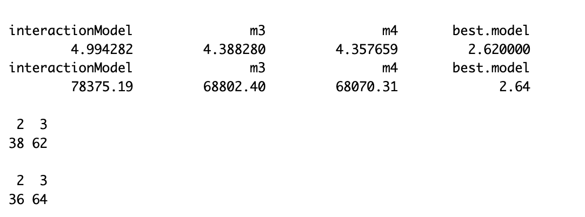

\newcommand{\noin}{\noindent}    
\newcommand{\Var}{\text{Var}}    
\newcommand{\Cov}{\text{Cov}}    

\begin{small} 
\noindent This assignment is \textbf{due Friday, November 3 at 11:59pm}, handed in on Gradescope (remember, there are two separate submissions, one for your pdf, and another for you rmd file).  Show your work and provide clear, explanations when asked.  \textbf{Incorporate the \underline{relevant} R output in this R markdown file}. Only the key output should be displayed for each problem and the relevant parts should be \textbf{highlighted} in some way.  Make sure that you write-up any interpretation of R-code in your own words (don't just provide the output).

\normalsize

\vspace{0.1in}

\noindent \textbf{Collaboration policy (for this and all future problem sets)}: You are encouraged to discuss the problems with other students, but you must write up your solutions yourself and in your own words. Copying someone else's solution, or just making trivial changes is not acceptable. 
\vspace{0.1in}
		
\end{small}
	
**Problem 1.** 

$X_1,\ X_2,$ and $X_3$ are three explanatory variables in a multiple regression with $n=28$ cases.  The following table shows the residual sum of squares and degrees of freedom for all models (note: this table is in the file \texttt{ABC.csv} to facilitate using \textsf{R} to do the calculations):
\begin{center}
\begin{tabular}{ccc}
\bf{Model} & \bf{Residual sum} & \bf{Degrees} \\
\bf{Variables} & \bf{of squares} & \bf{of freedom} \\
\hline
None & 8,100 & 27 \\
$X_1$ & 6,240 & 26 \\
$X_2$ & 5,980 & 26 \\
$X_3$ & 6,760 & 26 \\
$X_1,X_2$ & 5,500 & 25 \\
$X_1,X_3$ & 5,250 & 25 \\
$X_2,X_3$ & 5,750 & 25 \\
$X_1,X_2,X_3$ & 5,160 & 24 \\
\end{tabular}
\end{center}

(a) Calculate 3 statistics for each model: the estimate of $\sigma^2$, AIC, and BIC.

```{r 1a}
# load data
abc <- read.csv("data/abc.csv")
colnames(abc) <- c("var", "RSS", "df")
n <- 28

# calculate
# df = n-p-1 --> n-df = p+1
abc$sigma.sq = abc$RSS/abc$df
abc$AIC = n*log(abc$RSS/n) + (n-abc$df)*2
abc$BIC = n*log(abc$RSS/n) + (n-abc$df)*log(n)

abc
```


(b) Summarize which model(s) is/are ranked best for each of the 3 statistics from part (a).

\textcolor{blue}{Model that includes $X_1$ and $X_3$ has the lowest $\sigma^2$, lowest AIC, and lowest BIC and is thus ranked best by all three metrics.}

(c) Using the residual sum of squares, find the model indicated by forward selection.  Start with the model 'None', and identify the single-variable model that has the smallest residual sum of squares, then perform an extra-sum-of-squares $F$-test to determine if that variable is significant.  If it is, continue with the 2 predictor model.  Continue until no more significant predictors can be added.  Is this procedure guaranteed to find the "best" model (that is, where a determination of "best" is based on residual sum of squares)? 

```{r 1c}
# ESS F-test comparing `none` and `x2`
fstat.1 <- ((abc$RSS[1] - abc$RSS[3])/1)/(abc$RSS[3]/(abc$df[3]))
1 - pf(fstat.1, 1, abc$df[3])

# ESS F-test comparing `x2` and `x1x2`
fstat.2 <- ((abc$RSS[3] - abc$RSS[5])/1)/(abc$RSS[5]/(abc$df[5]))
1 - pf(fstat.2, 1, abc$df[5])
```

\textcolor{blue}{Starting with the model \texttt{None}, we proceed with the model \texttt{x2} because it is the single-variable model with the smallest RSS. Since the F test statistic is `r round(fstat.1,3)` and the p-value is 0.005, we reject the null hypothesis and conclude that adding $X_2$ significantly improves the model.}

\textcolor{blue}{Now we proceed with model \texttt{x2}. We compare it with model \texttt{x1x2} because it is the double-variable model with the smallest RSS. Since the F test statistic is `r round(fstat.2,3)` and the p-value is 0.152, we retain the null hypothesis and conclude that adding $X_1$ does not improve the model, and we stop with model \texttt{x2}.}

\textcolor{blue}{In part (a), we found that the model with the lowest RSS is \texttt{x1x2x3}, so this method doesn't guarantee that we end up with the "best" model. This is because forward selection can get us stuck with a locally optimal model (and perhaps few predictors) without considering all possible models, and the lowest-RSS method generally gives us the model with the highest number of predictors.}

\vspace{0.2in}


**Problem 2.** 

What are risk factors for elevated blood pressure in the US (measured by systolic blood pressure, in mm Hg)?  Several variables from the National Health and Nutrition Examination Survey (NHANES) are stored in \texttt{nhanes.csv}.

Descriptions of the variables are included below.

\footnotesize

  - \texttt{systolic}: systolic blood pressure, measured in mm Hg.

  - \texttt{workhours}: self-reported number of hours in a typical work week.
  
  - \texttt{jobtype}: description of job/work situation. The codes \texttt{1} through \texttt{5} correspond to an employee of a private company/individual for wages or salary, a federal government employee, a state government employee, a local government employee, or self-employed.

  - \texttt{smoke}: coded \texttt{1} if the participant smokes regularly, \texttt{0} otherwise.
  
  - \texttt{sleep}: self-reported number of hours study participant usually gets on weeknights or workdays; reported for participants aged 16 years or older.
  
  - \texttt{active}: coded \texttt{1} if participant does moderate or vigorous intensity sports, fitness, or recreational activities; reported for participants 12 years or older.

  - \texttt{diabetes}: coded \texttt{1} if the participant was told by a health professional that they have diabetes, \texttt{0} otherwise.
  
  - \texttt{alcohol}: coded \texttt{1} if the participant has consumed at least 12 drinks of any type of alcoholic beverage in any one yer; reported for participants aged 18 years or older
  
  - \texttt{female}: coded \texttt{1} if the participant is female, \texttt{0} otherwise.
  
  - \texttt{age}: age in years at screening. Subjects 80 years or older were recorded as 80 years of age.
  
  - \texttt{poverty}: a ratio of family income to poverty guidelines. Smaller numbers indicate more poverty; i.e., a number below 1 indicates income below the poverty level.  
  
  - \texttt{married}: marital status of study participant; reported for participants aged 20 or older. The codes \texttt{1} through \texttt{6} correspond to married, widowed, divorced, separated, never married, or living with partner.
  
  - \texttt{education}: highest educational level of study participant, reported for participants aged 20 years or older. The codes \texttt{1} through \texttt{5} correspond to 8th grade, 9 to 11th grade, high school, some college, or college graduate.

  - \texttt{race}: reported race of study participant: 1 = Mexican, 2 = Hispanic, 3 = White, 4 = Black, 6 = Asian, or 7 = Other.
  
  - \texttt{foreignborn}: coded \texttt{1} if participant was not born in the US, \texttt{0} otherwise
  
  - \texttt{heartrate}: 60 second pulse rate
  
  - \texttt{height}: standing height, measured in centimeters.  
  
  - \texttt{weight}: weight, measured in kilograms.
  
  - \texttt{waist}: waist circumference, measured in centimeters.
  
  - \texttt{bmi}: body mass index
  
\normalsize

(a)  Explore the data graphically and decide whether the outcome variable (\texttt{systolic}) or any predictor variable(s) need to be transformed.  Make sure you define any categorical variables as factors in R.  If you decide to transform the response, use this transformed version as the response/outcome variable for all future models.

```{r 2a}
nhanes <- read.csv("data/nhanes.csv")

cols <- c("jobtype", "smoke", "active", "diabetes", "alcohol", 
          "female", "married", "educ", "race", "foreignborn")

for(i in 1:length(cols)){
  nhanes[[cols[i]]] <- as.factor(nhanes[[cols[i]]])
}

# we should log transform the outcome var
hist(nhanes$systolic, breaks=20)
nhanes$t.systolic <- log(nhanes$systolic)

# peek
par(mfrow=c(2,2))
hist(nhanes$workhours)
hist(nhanes$sleep)
hist(nhanes$poverty)
hist(nhanes$age)
hist(nhanes$heartrate)
hist(nhanes$height)
hist(nhanes$weight)
hist(nhanes$waist)
hist(nhanes$bmi)

df.nhanes <- subset(nhanes, select=-c(systolic, id))
```

\textcolor{blue}{I decided to log transform the response variable because the untransformed version is right-skewed. I also changed the categorical variables from numeric into factor variables.}

(b) Fit a model with 'main effects' of all available predictors in their transformed states (call this \textbf{model1}). Your model should have 2332 degrees of freedom associated with the residuals (unless you used exotic transformations).  Identify significant predictors (ignoring multiple comparisons). 

```{r 2b}
model1 <- lm(t.systolic ~ ., df.nhanes)
summary(model1)
```
\textcolor{blue}{According to the model output summary above, the significant predictors include \texttt{female1} (being female), \texttt{age}, \texttt{married5} (never married), \texttt{educ5} (college graduate), \texttt{race4} (Black), and \texttt{heartrate}.}

(c) Use the \textbf{backward} variable selection procedure based on AIC to build a prediction model for \texttt{systolic} (transformed appropriately), starting from a model with all main effects. You may find the function \texttt{step()} helpful. 
There is no need to report the intermediate output of the \texttt{step()} function in your write-up, just report this model's coefficient estimates (not the full `summary` output), $R^2$, and AIC. Call the resulting model \textbf{model2}.

  The function \texttt{lm()} has some useful shortcuts for specifying formulas. For example, to include the main effects of all variables in the dataset \texttt{MyData}:
   
```{r 2c}
# to include the main effects of all variables in the dataset \texttt{MyData}
# lm(y ~ ., data = MyData)

# To include all variables and their pairwise interactions:
# lm(y ~ .^2, data = MyData)

# build model
model2 <- step(model1, direction="backward", trace=0)

# pull outputs
model2$coefficients
summary(model2)$r.squared
AIC(model2)
```
\textcolor{blue}{The AIC of \texttt{model2} is `r AIC(model2)`, and the $R^2$ is `r round(summary(model2)$r.squared,3)`.}

(d)  Next, run a \textbf{forward} variable selection procedure starting with \textbf{model2}, with the upper scope for the final model set to include all the two-way interaction terms for the variables in \textbf{model2}. Report this model's coefficient estimates, $R^2$, and AIC.  Call this \textbf{model3}.

Note: The predictors from \textbf{model2} can be printed in a list in R via the command \texttt{model2\$terms[[3]]}. This forward variable selection can be performed using the \texttt{step()} function as follows, where \texttt{interactionModel} is the \texttt{lm} fit with all variables from \textbf{model2} and their interactions:

```{r 2d}
# model2$terms[[3]]

interactionModel <- lm(t.systolic ~ (sleep + female + age + married + educ + race 
                                     + heartrate + height + waist + bmi)^2, 
                       df.nhanes)

model3 <- step(model2, 
     scope = list(upper = formula(interactionModel)), 
     direction = "forward", 
     trace=0)

model3$coefficients
summary(model3)$r.squared
AIC(model3)
```

\textcolor{blue}{The AIC of \texttt{model2} is `r AIC(model3)`, and the $R^2$ is `r round(summary(model3)$r.squared,3)`.}

(e) Finally, use a combined \textbf{stepwise} procedure to perform model selection. Start with a model with all main effects and specify the intercept-only model (\textbf{model0}) as a lower limit model and a full model including all two-way interactions of *all* possible predictor variables as the upper-limit as shown below (call this the **fullInteractionModel**).  Report this model's coefficient estimates, $R^2$, and AIC.  Call this \textbf{model4}.  Note, this may take a minute or two...the use of the code chunk option `cache=TRUE` can be helpful so you do not need to wait for this to run every time you want to knit the file into a pdf.

```{r 2e, cache=TRUE}
model0 <- lm(t.systolic ~ 1, df.nhanes)
fullInteractionModel <- lm(t.systolic ~ .^2, df.nhanes)

model4 <- step(model1, scope = list(lower = formula(model0), 
                                    upper = formula(fullInteractionModel)), 
               direction = "both", trace=0)

model4$coefficients
summary(model4)$r.squared
AIC(model4)
```
      
\textcolor{blue}{The AIC of \texttt{model4} is `r AIC(model4)`, and the $R^2$ is `r round(summary(model4)$r.squared,3)`.}

(f) Select a best final model among 5 models based on their AICs: **model1** through **model4** and the **fullInteractionModel**.  Perform a brief model check of assumptions on your selected model. 

```{r 2f}
# get AIC
AIC(model1)
AIC(model2)
AIC(model3)
AIC(model4)
AIC(fullInteractionModel)

# check assumptions
plot(model4, which=c(1,2))
```

\textcolor{blue}{The best model, which has the lowest AIC, is \texttt{model4}. In terms of assumptions, the linearity assumption is satisfied because the points are equally distributed above and below the horizontal line (per plot 1). The homoskedasticity assumption is also met; there doesn't seem to be any fanning/funneling pattern (per plot 1). The normality assumption is also met because the standardized quantiles of the residuals closely resemble the theoretical quantiles in the QQ plot. The independence assumption is met depending on the design of the study (eg. if subjects are related and if the condition is genetic-based, then the independence assumption might not be met).}

(g) Use the model chosen in part (f) to interpret the association of systolic blood pressure with the variable \texttt{female}. If \texttt{female} is not in your chosen model in any fashion, interpret what that means.

\textcolor{blue}{In \texttt{model4}, the coefficient estimate for \texttt{female1} is -0.108. This means that holding all other predictors at 0, being female decreases the systolic blood pressure by 0.108 mm Hg compared to being male.}

\textcolor{blue}{The coefficient estimate for \texttt{alcohol1:female1} is -0.0264. This means that holding all other interaction predictors (except for alcohol) at 0, when a person drinks, the difference in systolic blood pressure of an average female individual vs an average male individual is $-0.108-0.0264 = -0.1344$ mm Hg.}

\textcolor{blue}{The coefficient estimate for \texttt{female1:age} is 0.00114. This means that holding all other interaction predictors (except for age) at 0, when age increases by 1, the difference in systolic blood pressure of an average female individual vs an average male individual becomes $-0.108 + 0.00114 = -0.10686$ mm Hg.}

\textcolor{blue}{The coefficient estimate for \texttt{sleep:female1} is -0.00735. This means that holding all other interaction predictors (except for sleep) at 0, when hours of sleep increase by 1, the difference in systolic blood pressure of an average female individual vs an average male individual becomes $-0.108 - 0.00735 = -0.11535$ mm Hg.}

\textcolor{blue}{The coefficient estimate for \texttt{female1:poverty} is -0.00444. This means that holding all other interaction predictors (except for poverty) at 0, when the poverty index increases by 1 unit (person becomes more well off), the difference in systolic blood pressure of an average female individual vs an average male individual becomes $-0.108 - 0.00444 = -0.11244$ mm Hg.}

\textcolor{blue}{The coefficient estimate for \texttt{female1:waist} is 0.00254. This means that holding all other interaction predictors (except for waist) at 0, when the waist circumference increases by 1 cm, the difference in systolic blood pressure of an average female individual vs an average male individual becomes $-0.108 + 0.00254 = -0.10546$ mm Hg.}

\textcolor{blue}{The mean difference between systolic blood pressure between female and male individuals is $-0.108 - 0.0264a + 0.001140b - 0.00735c - 0.00444d + 0.00254e$ mmHg, where (a, b, c, d, e) are the interaction terms between female 1 and (alcohol1, age, sleep, poverty, waist), respectively, while holding all the other coefficient estimates and interaction estimates constant. If we consider two average individuals who, say, both drink (alcohol=1), are ~42 years old, sleep ~7 hours a night, have a poverty index of ~2.8, and have a waist of ~38cm, and other factors being equal, the difference in systolic blood pressure between the female and male individual is -0.05 mmHg, per the calculation below (i.e. the male individual has higher systolic bp on average).}

```{r 2g}
-0.108 - 0.0264*(1) + 0.001140*mean(df.nhanes$age) - 0.00735*mean(df.nhanes$sleep) - 0.00444*mean(df.nhanes$poverty) + 0.00254*mean(df.nhanes$waist)
```


\newpage


**Problem 3.**

Use cross-validation to compare three different models from the previous problem (as defined below) to predict your (transformed) systolic response variable.

  1. **interactionModel** from 2(d)
  2. **model3** 
  3. **model4** 

For each of the three models, do the following:

  - For 100 iterations, randomly select 2,000 observations on which to train each model, and keep the remaining observations as the validation set in each iteration.  
  - Predict both systolic blood pressure and log-transformed systolic blood pressure for all observations in the validation sets, and save the residual sums of squares of the validation set in each iteration (for the 2 versions of the response: log and untransformed). 
  
In your solution, summarize your results as to which of the three models performs best in predicting systolic blood pressure and which performs best in predicting log-transformed systolic blood pressure. Be sure to address whether the choice of best model agree with your selection from the problem 2.

*Note*: if you were to actually then use the best model for future observations, you should always refit the chosen model on all the data sampled, not just one training set (here, of $n=2000$).

```{r 3, eval=F, warning = FALSE, message = FALSE}
nsims <- 100
rss <- data.frame(interactionModel = as.numeric(),
          m3 = as.numeric(),
          m4 = as.numeric(),
          best.model = as.numeric())
t.rss <- data.frame(interactionModel = as.numeric(),
          m3 = as.numeric(),
          m4 = as.numeric(),
          best.model = as.numeric())

for (i in 1:nsims){

  train.ids = sample(1:nrow(df.nhanes), 2000)
  train = df.nhanes[train.ids,]
  test = df.nhanes[-train.ids,]
  
  fit1 = lm(formula(interactionModel), data=train)
  fit2 = lm(formula(model3),           data=train)
  fit3 = lm(formula(model4),           data=train)
  
  # transformed rss
  t.rss[i,1] <- sum((test$t.systolic - predict(fit1, new=test))^2)
  t.rss[i,2] <- sum((test$t.systolic - predict(fit2, new=test))^2)
  t.rss[i,3] <- sum((test$t.systolic - predict(fit3, new=test))^2)
  t.rss[i,4] <- which.min(t.rss[i, ])
  
  # untransformed rss
  rss[i,1] <- sum((exp(test$t.systolic) - exp(predict(fit1, new=test)))^2)
  rss[i,2] <- sum((exp(test$t.systolic) - exp(predict(fit2, new=test)))^2)
  rss[i,3] <- sum((exp(test$t.systolic) - exp(predict(fit3, new=test)))^2)
  rss[i,4] <- which.min(rss[i, ])
}

colMeans(t.rss)
colMeans(rss)

table(t.rss[,"best.model"])
table(rss[,"best.model"])
```


\textcolor{blue}{The third choice of model (\texttt{model4}) performs the best most of the time in both predicting the log-transformed systolic blood pressure and the untransformed systolic blood pressure. We can see this based on the low mean RSS of model 3 (compared to that of other models) and the fact that model 3 has the lowest mean RSS the most number of times for predicting both log-transformed and untransformed systolic bp. This result is consistent with what I found in problem 2.}

\newpage


**Problem 4.** 

This problem is intended to investigate the optimal choice of train-validation splitting ratios in a model comparison problem.  We will be comparing $k$-fold cross-validation for $k \in \{2,10,25\}$.  For $n=50$ (and eventually also for $n=500$), create data based on the following data-generating process:

i) Sample $Z_1,Z_2,Z_3,X_1,...,X_{10}$ all independently from the standard normal distribution.

ii) Sample $(Y|\vec{Z},\vec{X})\sim N(1\cdot Z_1+3\cdot Z_2+9\cdot Z_3,5^2)$ independently from each other.

*Note, it is more efficient to sample all $Z_1,Z_2,Z_3$ and $\vec{X}$ for each iteration from one `rnorm` function call, and then reorganize them into the separate variables for data creation and model fitting.

For each of `nsims=200` iterations, perform $k$-fold cross-validation (for each of the 3 choices of $k$ mentioned above) to determine which of the 4 following models is the best out-of-sample prediction model separately for each choice of $k$:

1) `lm(Y ~ Z3)`
2) `lm(Y ~ Z2 + Z3)`
3) `lm(Y ~ Z1 + Z2 + Z3)`
4) `lm(Y ~ Z1 + Z2 + Z3 + X1 + X2 + ... + X10)`

In the end for each choice of $k$, you should determine which of the 4 models above is *best* for 200 iterations.

```{r 4 setup, cache=T}
# defining your own simulation function could be useful but not required.
# but much sure your approach is working outside of the function before defining one
# my.sim = function(n = 50, nsims = 200, k = c(2,10,25), seed = NA)

# you simulation code here
library(caret)
nsims=200

data <- data.frame(Y = as.numeric(),
          Z1 = as.numeric(),
          Z2 = as.numeric(),
          Z3 = as.numeric(),
          X1 = as.numeric(),
          X2 = as.numeric(),
          X3 = as.numeric(),
          X4 = as.numeric(),
          X5 = as.numeric(),
          X6 = as.numeric(),
          X7 = as.numeric(),
          X8 = as.numeric(),
          X9 = as.numeric(),
          X10 = as.numeric())

best.model <- rep(NA, nsims)

findBest <- function(n, k){

  for(i in 1:nsims){
  
    # generate predictors
    for(j in 1:n){
      data[j,2:14] <- rnorm(13, 0, 1)
      data[j,"Y"] <- rnorm(1, 1*data[j,"Z1"] + 3*data[j,"Z2"] + 9*data[j,"Z3"], 5)
    }
      
    # k fold cv
    cv  <- trainControl(method="cv", number=k)
    lm1 <- train(Y ~ Z3,           data=data, method="lm", trControl=cv)
    lm2 <- train(Y ~ Z2 + Z3,      data=data, method="lm", trControl=cv)
    lm3 <- train(Y ~ Z1 + Z2 + Z3, data=data, method="lm", trControl=cv)
    lm4 <- train(Y ~ .,            data=data, method="lm", trControl=cv)
    
    # get rmse
    rmse <- c(lm1$results$RMSE,
              lm2$results$RMSE,
              lm3$results$RMSE,
              lm4$results$RMSE)
    
    best.model[i] <- which.min(rmse)
  }
  
  return(best.model)
}
```

(a) How often is each model selected as best (as measured by average validation set squared error)?  Provide a 4 x 3 table that displays the number of times each model is chosen where the columns represent the choice of $k$ and the rows represent each model mentioned above.  Note: the columns should sum up to `nsims=200`.

\textcolor{blue}{We see that across the 3 values of k, model 3 is the best the most number of times, closely followed by model 2. As k becomes larger, model 3 outperforms model 2 more frequently. Models 1 and 4 perform the best the least number of times.}

```{r 4a, cache=T}
k2  <- findBest(n=50, k=2)
k10 <- findBest(n=50, k=10)
k25 <- findBest(n=50, k=25)

best50 <- data.frame("k2"  = c(sum(k2==1),  sum(k2==2),  sum(k2==3),  sum(k2==4)),
                     "k10" = c(sum(k10==1), sum(k10==2), sum(k10==3), sum(k10==4)),
                     "k25" = c(sum(k25==1), sum(k25==2), sum(k25==3), sum(k25==4)))
rownames(best50) <- c("model1", "model2", "model3", "model4")
best50
```

(b) Interpret the results: is there a clear winner for the choice of $k$ here?  How often is each cross-validation choosing the *correct* model?  Do they tend to favor the underfit or overfit models?  Explain.

\textcolor{blue}{The clear winner is $k=25$, which gives us the most accurate result; in this scenario, model 3 (the correct model) performs the best most often, compared to other scenarios of different k values. $k=2$ chooses the correct model 48\% of the time, $k=10$ chooses the correct model 47\% of the time, and $k=25$ chooses the correct model 53.5\% of the time. Since we often get simpler models than more complex ones, we tend to underfit than overfit the data.}

(c) Rerun the simulation above for $n=500$.  Provide the analogous 4 x 3 table to part (a) above.

```{r 4c, cache=T}
k2c  <- findBest(n=500, k=2)
k10c <- findBest(n=500, k=10)
k25c <- findBest(n=500, k=25)

best500 <- data.frame("k2"  = c(sum(k2c==1),  sum(k2c==2),  sum(k2c==3),  sum(k2c==4)),
                      "k10" = c(sum(k10c==1), sum(k10c==2), sum(k10c==3), sum(k10c==4)),
                      "k25" = c(sum(k25c==1), sum(k25c==2), sum(k25c==3), sum(k25c==4)))
rownames(best500) <- c("model1", "model2", "model3", "model4")
best500
```


(d) Compare the results for the $n=50$ and $n=500$ cases.  Is there a clear winner for the choice of $k$ when $n=500$?  How does sample size affect the choice of the *underfit*, *correct*, and *overfit* models (in this context)?  Explain.

\textcolor{blue}{There isn't a clear winner for the choice of $k$ when $n=500$; I think that both $k=10$ and $k=25$ give us similar results (although the selection method doesn't perform as well at $k=2$). When sample size is small, though, we get more underfit models a lot more often. In fact, when sample size is 50, model 2 and model 3 perform the best with similar frequencies, but model 3 performs the best most often by a wide margin when the sample size is 500.}

(e) What is missing/lacking in this small simulation study?  How would you modify or extend this simulation to better *investigate the optimal choice of train-validation splitting ratios in a model comparison problem*?  Explain your choice(s) in up to 8 sentences (do not implement these changes!!!).

\textcolor{blue}{We can vary the simulation a lot to study how different factors might impact the model outcome. For one, we can have the true predictors, useless variables, and response variable take on a different distribution other than Normal and see whether cross-validation tends to gives us overfit or underfit model, whether it can detect the true distribution of each predictor, what the optimal number of folds is. It can also be a simple change like keeping all the predictors as normally distributed but varying the variances so that they are not all standard normal. Another change we can make is to vary the number of true predictors vs useless variables: like in lecture, we can have different scenarios where we have a few useful predictors and lots of useless variables; many weak predictors; or no useful predictors. Moreover, we can also utilize LASSO and Ridge regression to shrink the coefficient estimates along with doing k-fold cross validations to find the useful predictors and appropriate models. Lastly, we can vary the types of model used; we can use polynomials or other fancier models instead of simple first-order predictors like in this problem.}